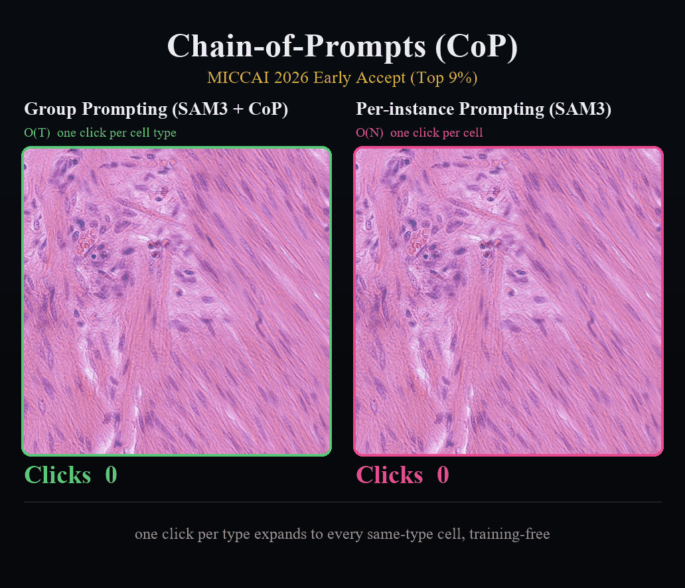
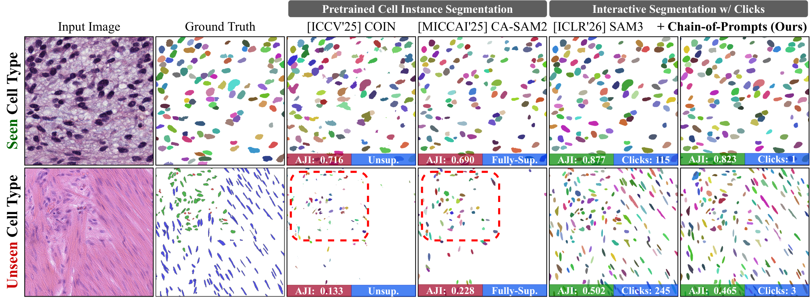
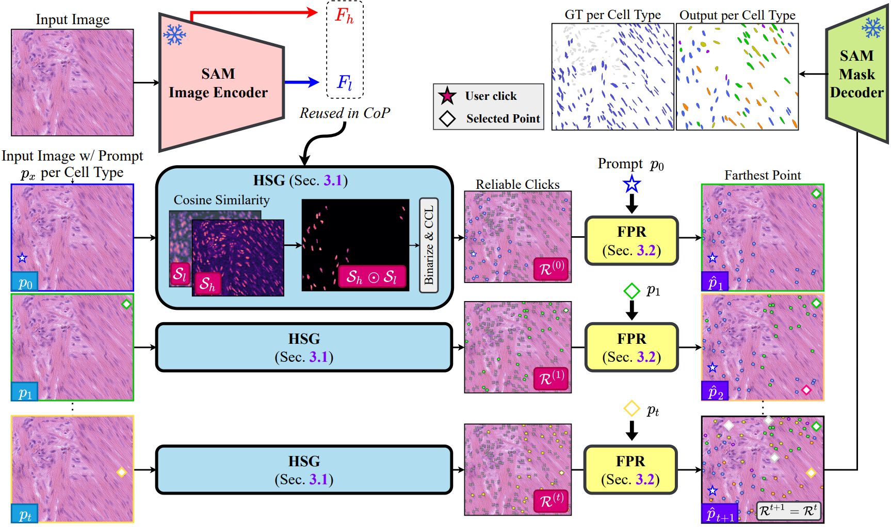
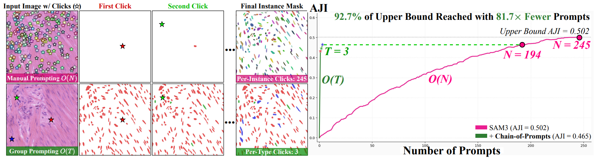
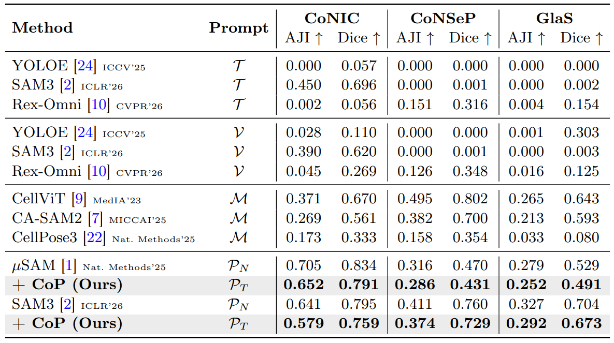
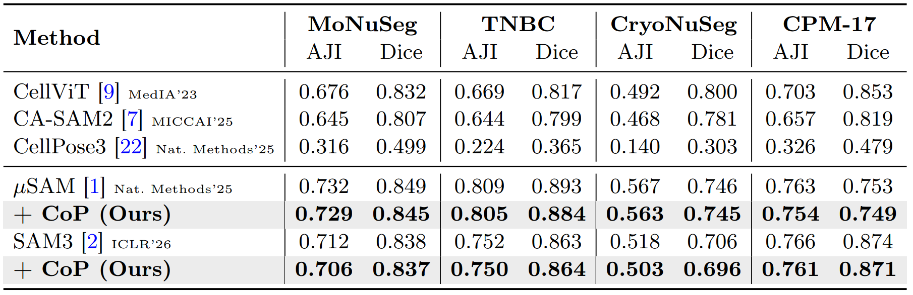
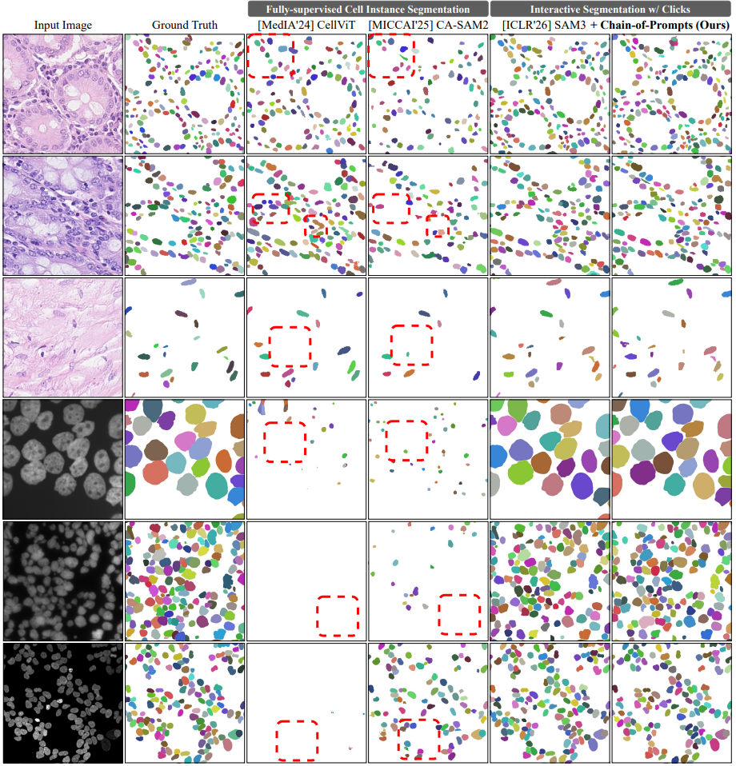
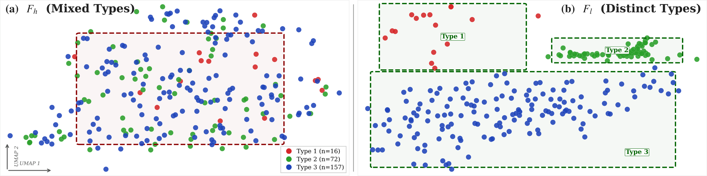

<div align="center">

# One Click per Cell Type Suffices: Training-free Group Interaction for Cell Instance Segmentation

**Method: Chain-of-Prompts (CoP)** &nbsp;|&nbsp; ⭐ MICCAI 2026 Early Accept (Top 9%)

[](https://shjo-april.github.io/Chain-of-Prompts)
[](https://arxiv.org/pdf/2605.29429)
[](https://arxiv.org/abs/2605.29429)
[](./LICENSE)

[Sanghyun Jo](https://shjo-april.github.io/)<sup>1,2</sup>, Seo Jin Lee<sup>2</sup>, Seohyung Hong<sup>2</sup>, Yoorim Gang<sup>2</sup>, [Hyeongsub Kim](https://sites.google.com/view/hyeongsub/)<sup>2,3</sup>, Hyungseok Seo<sup>2†</sup>, [Kyungsu Kim](https://aibl.snu.ac.kr/team/pi-information)<sup>2†</sup>

<sup>1</sup>OGQ &nbsp; <sup>2</sup>Seoul National University &nbsp; <sup>3</sup>LG CNS &nbsp; <sup>†</sup>Corresponding authors

</div>

---

> **This is the demo release.** It contains the training-free inference core, the unified
> SAM interface, two reproduction notebooks, and the benchmark test splits. Evaluation 
> will be added incrementally. Please ⭐ star and 👁️ watch for updates.

<div align="center">
  
  <br><em>Group Prompting (SAM3 + CoP) segments every cell in 3 clicks; per-instance prompting (SAM3) keeps clicking to 245.</em>
</div>

## 💡 TL;DR

Cell-specific models break on unseen cell types, and interactive foundation models such as
SAM 3 need one click per cell. **Chain-of-Prompts (CoP)** turns a **single click per cell
type** into every same-type instance, shifting interaction from per-instance **O(N)** to
per-type **O(T)**. With **3 clicks instead of 245 (81.7× fewer)**, CoP keeps **92.7% of the
per-instance upper bound**, fully training-free.

<div align="center">
  
  <br><em>Figure 1. Cell-specific models miss unseen cell types and interactive models need one click per cell; CoP needs only one click per cell type.</em>
</div>

## ✨ Key Features

- **Group Prompting, O(N) → O(T).** One click per cell type, not per cell. Robust to
  out-of-distribution cell types with no cell-specific training.
- **Training-free core (`core/cop.py`).** Two ideas, no backprop:
  - **HSG** (Hierarchical Similarity Gating): gates a frozen encoder's high and low
    resolution features, thresholds at μ+σ, and extracts reliable same-type points.
  - **FPR** (Farthest Prompt Recursion): re-prompts the farthest uncovered point until
    coverage converges, then decodes each point with the frozen mask decoder (guard + NMS).

    The public core is compact and maps one to one to the paper. It carries **no
    evaluation, metric, or plotting code**, so the method itself is easy to read and reuse.
- **Unified SAM interface (`core/sam`).** A single `ImageSAM(checkpoint, backend)` (and
  `VideoSAM`) API across the SAM family used in the paper: **SAM1-H**, **μSAM (micro-SAM)**,
  **SAM 2.1**, and **SAM 3**, plus HQ-SAM, ZIM, and EdgeTAM. Frozen multi-scale encoder
  features are exposed through `encode_image()`, which is exactly what CoP consumes. The
  same interface drives every SAM-family baseline reported in the paper, so swapping a
  backbone is a one-line change.
- **Reproducible.** [`reproduce_figure2.ipynb`](./reproduce_figure2.ipynb) rebuilds the
  paper's Figure 2 (O(T) vs. O(N) and the AJI curve); [`demo.ipynb`](./demo.ipynb) is an
  image-only minimal run. Benchmark test splits ship with the repo (see
  [Datasets](#-datasets)).

## 🔍 Method

<div align="center">
  
</div>

A frozen SAM encoder is run **once** per image. **HSG** turns each click into a reliable
point set via hierarchical similarity gating and connected-component labeling. **FPR** then
iteratively re-prompts the farthest uncovered point until no new cells appear, and the
converged set is decoded into instance masks with non-maximum suppression at IoU > 0.5.

## 📊 Results

CoP is training-free and adds no parameters to the frozen backbone. Numbers below are the
AJI on each test split (see the figures for Dice and the full set of baselines).

<div align="center">
  
  <br><em>Figure 2. Group Prompting (O(T)) vs. per-instance prompting (O(N)) on CoNSeP/test_2, with the AJI vs. number of prompts curve.</em>
</div>

### Cell-type-annotated benchmarks (one click per cell type)

A single click per cell type retains over **90%** of the per-instance upper bound and
**surpasses fully-supervised methods that require complete masks**, with no training. The
table reports five prompt regimes (text 𝒯, visual 𝒱, mask ℳ, per-instance points 𝒫ₙ,
per-type points 𝒫ₜ) across CoNIC, CoNSeP, and GlaS:

<div align="center">
  
</div>

### Morphologically homogeneous benchmarks (a single click)

When the cells in an image share morphology, one click segments them all, keeping over
**99%** of the per-instance backbone (μSAM and SAM 3):

<div align="center">
  
</div>

### Why it works

<div align="center">
  <!--  -->
  
</div>

CoP recovers cell populations that supervised models drop (red boxes), because the frozen
SAM encoder already clusters same-type cells in feature space before any prompt is given
(UMAP): grouping needs the right propagation rule, not fine-tuning.

## 🗂️ Repository Structure

```
Chain-of-Prompts/
├── core/
│   ├── cop.py                 # Chain-of-Prompts: HSG + FPR + decoding (the public core)
│   └── sam/                   # Unified SAM interface (SAM1-H, μSAM, SAM 2.1, SAM 3, HQ-SAM, ZIM, EdgeTAM)
│       ├── __init__.py        #   ImageSAM / VideoSAM wrappers (encode_image, predict)
│       ├── build_sam.py       #   backend builders
│       ├── predictor.py       #   per-backend predictors
│       ├── configs/           #   model configs
│       └── modeling/          #   sam1 / sam2 / sam3 / zim model code
├── examples/                  # demo image + Figure 2 reference data
├── assets/                    # paper figures
├── reproduce_figure2.ipynb    # rebuilds Figure 2 (O(T) vs. O(N) + AJI curve)
├── demo.ipynb                 # image-only minimal demo
├── data/                      # test splits, cell-type-annotated (see DATASETS.md)
├── data_wo_type/              # test splits, morphologically homogeneous
├── requirements.txt
└── DATASETS.md                # dataset licenses and attributions
```

Where to look first: `core/cop.py` is the entire method; `core/sam/__init__.py` is the one
interface used for every backbone.

## 🛠️ Installation

```bash
python3 -m venv venv && source ./venv/bin/activate     # Windows: .\venv\Scripts\activate
python3 -m pip install -r requirements.txt
```

Requirements: Python ≥ 3.10, PyTorch ≥ 2.1, CUDA ≥ 11.8, a single GPU (the demo runs on a
12 GB card).

### SAM 3 checkpoint (gated)

SAM 3 is released by Meta under the [SAM License](https://ai.meta.com/sam) and is **gated**
on Hugging Face. We do **not** redistribute the weights. To run the demos:

1. Accept the license and request access at the official model page (`facebook/sam3`).
2. Download the checkpoint into a local folder, for example `./checkpoints/sam3/`.
3. Point the notebooks to it via `MODEL_DIR`.

```python
from core.sam import ImageSAM
model = ImageSAM("./checkpoints/sam3", "sam3")     # backend in {sam1, sam2, sam3, zim}
```

## 🚀 Quick Start

Minimal, image only:

```python
import cv2
from core.sam import ImageSAM
from core.cop import ChainOfPrompts

model = ImageSAM("./checkpoints/sam3", "sam3")
cop   = ChainOfPrompts(model)

image  = cv2.imread("./examples/CoNSeP_test_2.png")     # BGR
clicks = [(292, 395), (171, 539), (684, 958)]           # one click per cell type
label_map, overlay, info = cop.segment(image, clicks)
print(info["num_instances"], "cells from", info["num_clicks"], "clicks")
```

- [`demo.ipynb`](./demo.ipynb): one click per cell type, round by round, on a single image.
- [`reproduce_figure2.ipynb`](./reproduce_figure2.ipynb): the full Figure 2 reproduction.

## 📁 Datasets

The **test split** of each included benchmark is provided, reorganized into a unified layout. Within
a dataset the three subfolders share one filename per example: `image` is the H&E crop,
`mask` is the instance label map, and `mask_semantic` (cell-type benchmarks only) is the
per-cell-type label map.

```
data/                                          # cell-type-annotated
└── GlaS/test/{image, mask, mask_semantic}     #   12 images   (.png)

data_wo_type/                                  # morphologically homogeneous (no type labels)
├── MoNuSeg/test/{image, mask}                 #   14 images   (.tif)
├── TNBC/test/{image, mask}                    #   10 images   (.png)
└── CryoNuSeg/test/{image, mask}               #   10 images   (.tif)
```

GlaS, MoNuSeg, TNBC, and CryoNuSeg are included. **CoNIC** (large, about 700 MB), **CoNSeP**,
and **CPM-17** are not shipped (size, or missing or unclear license); please download them
from the original sources. All source links and license details are in
[DATASETS.md](./DATASETS.md).

## 🙏 Acknowledgements

CoP is a successor to our annotation-free cell segmentation work
**[COIN (ICCV 2025)](https://github.com/shjo-april/COIN)**, and is powered by the
**Segment Anything Model** family from Meta. We thank the
authors of every dataset and foundation model we build on.

## 📖 Citation

```bibtex
@inproceedings{jo2026cop,
  title     = {One Click per Cell Type Suffices: Training-free Group Interaction for Cell Instance Segmentation},
  author    = {Jo, Sanghyun and Lee, Seo Jin and Hong, Seohyung and Gang, Yoorim and Kim, Hyeongsub and Seo, Hyungseok and Kim, Kyungsu},
  booktitle = {International Conference on Medical Image Computing and Computer Assisted Intervention (MICCAI)},
  year      = {2026},
  note      = {Early Accept (Top 9\%)}
}
```

## 📜 License

This repository is released for **non-commercial academic research only**.
Any commercial use requires prior written permission. For commercial licensing,
please contact **both**:

- Sanghyun Jo: shjo.april@gmail.com
- Kyungsu Kim: kyskim@snu.ac.kr

The vendored Segment Anything model code under `core/sam` and the SAM 3 weights are
governed by Meta's [SAM License](https://ai.meta.com/sam). Datasets follow their original
licenses (see [DATASETS.md](./DATASETS.md)).
