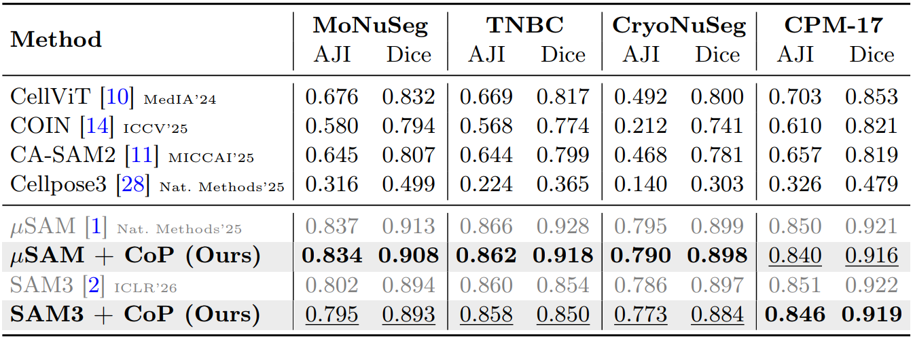
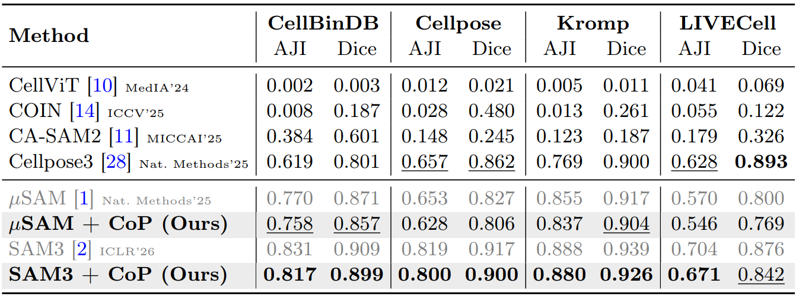

<div align="center">

# One Click per Cell Type Suffices: Training-free Group Interaction for Cell Instance Segmentation

**Method: Chain-of-Prompts (CoP)** &nbsp;|&nbsp; 📝 Under Review

[](https://shjo-april.github.io/Chain-of-Prompts)
[](https://arxiv.org/pdf/2605.29429)
[](https://arxiv.org/abs/2605.29429)
[](./LICENSE)

[Sanghyun Jo](https://shjo-april.github.io/)<sup>1,2</sup>, Seo Jin Lee<sup>2</sup>, Seohyung Hong<sup>2</sup>, Yoorim Gang<sup>2</sup>, [Hyeongsub Kim](https://sites.google.com/view/hyeongsub/)<sup>2,3</sup>, Hyungseok Seo<sup>2†</sup>, [Kyungsu Kim](https://aibl.snu.ac.kr/team/pi-information)<sup>2†</sup>

<sup>1</sup>OGQ &nbsp; <sup>2</sup>Seoul National University &nbsp; <sup>3</sup>LG CNS &nbsp; <sup>†</sup>Corresponding authors

</div>

---

> **This is the demo release.** It contains the training-free inference core, the unified
> SAM interface, a demo notebook, and the benchmark test splits. Evaluation
> will be added incrementally. Please ⭐ star and 👁️ watch for updates.

<div align="center">
  
  <br><em>Group Prompting (SAM 3 + CoP) segments every cell in 3 clicks; per-instance prompting (SAM 3) keeps clicking to 245.</em>
</div>

## 💡 TL;DR

Cell-specific models break on unseen cell types, and interactive foundation models such as
SAM 3 need one click per cell. **Chain-of-Prompts (CoP)** turns a **single click per cell
type** into every same-type instance, shifting interaction from per-instance **O(N)** to
per-type **O(T)**, fully training-free. Across **eleven benchmarks** it retains **over 90%**
of the per-instance upper bound while cutting annotation clicks by **97.6%** on average
(**42.5× fewer**). On the CoNSeP example below, **3 clicks replace 245** (81.7× fewer) at
**93.9%** of the upper bound.

<div align="center">
  
  <br><em>Figure 1. Pretrained cell-specific models fail on unseen cell types (dashed boxes) and interactive models need one click per cell; CoP needs only one click per cell type.</em>
</div>

<div align="center">
  
  <br><em>Figure 2. From 245 clicks to 3. Manual per-instance prompting O(N) vs. CoP group prompting O(T) on CoNSeP/test_2, with the AJI-vs-#prompts curve: CoP reaches <b>93.9%</b> of the per-instance upper bound with <b>81.7× fewer prompts</b>.</em>
</div>

## 📊 Results

CoP is training-free and adds no parameters to the frozen backbone. It is evaluated on
**eleven benchmarks** on their official test splits, in three groups. Numbers below are AJI
(see the tables for Dice and the full baseline set).

### One click per cell type: H&E, cell-type-annotated

A single click per cell type (𝒫ₜ) keeps **over 90%** of SAM 3's per-instance upper bound on
all three datasets (e.g., **0.731 vs. 0.801** AJI on CoNIC) and **surpasses every
fully-supervised and open-vocabulary baseline**, with no training. The table spans six
regimes: text (𝒯), visual (𝒱), unsupervised (✗), mask supervision (ℳ), per-instance points
(𝒫ₙ), and per-type points (𝒫ₜ) across **CoNIC, CoNSeP, and PanNuke**.

<div align="center">
  
</div>

### One click per image: H&E, untyped

When cells are morphologically homogeneous they act as a single type, so one click per image
propagates to the whole field: CoP retains **98–99%** of the per-instance upper bound for both
μSAM and SAM 3, still outperforming every fully-supervised baseline, on **MoNuSeg, TNBC,
CryoNuSeg, and CPM-17**.

<div align="center">
  
</div>

### One click per image: non-H&E, untyped

Under a staining-modality shift, H&E-trained supervised models collapse (CellViT drops from
**0.676** AJI on MoNuSeg to **0.002** on CellBinDB), while CoP, reading only the frozen
encoder's features, preserves **over 95%** of the per-instance upper bound on all four
non-H&E benchmarks: **CellBinDB, Cellpose, Kromp, and LIVECell**.

<div align="center">
  
</div>

### Qualitative Comparison

<div align="center">
  
  <br><em>Figure 4. Fully-supervised baselines miss cell populations outside their training distribution and collapse to near-empty masks under a modality change (dashed boxes); CoP recovers the missing instances from one click per type, or per image when types are unlabeled.</em>
</div>

## 🔍 How It Works

<div align="center">
  
</div>

A frozen SAM encoder is run **once** per image, producing a high-resolution feature map
𝐹ₕ and a low-resolution feature map 𝐹ₗ. For each user click, CoP applies two
training-free steps with no backprop:

- **HSG (Hierarchical Similarity Gating).** Gates the two scales via the element-wise product
  𝑆ₕ ⊙ 𝑆ₗ (𝐹ₕ localizes densely while 𝐹ₗ isolates the cell type), thresholds the
  gated map non-parametrically at **τ = μ + σ**, and runs connected-component labeling to
  extract a set of reliable same-type points (**precision > 96%** at every iteration).
- **FPR (Farthest Prompt Recursion).** Re-prompts the reliable point farthest (in image space)
  from all previous clicks, feeds it back into HSG, and repeats until no new points appear.

The converged point set is decoded into instance masks by the frozen mask decoder
(overlap guard + NMS at IoU > 0.5).

<div align="center">
  
  <br><em>Figure 5. UMAP of the frozen SAM encoder's features at GT cell centroids (CoNSeP/test_2). 𝐹ₕ mixes cell types, while 𝐹ₗ already groups same-type cells, before any prompt and without training.</em>
</div>

The frozen SAM encoder already clusters same-type cells in feature space before any prompt is
given, so grouping needs the right propagation rule, not fine-tuning. This structure comes
from SAM's prompt–mask pretraining, not encoder scale: swapping in DINOv3, EVA-CLIP, or SDXL
features drops CoP to ≤ 0.435 AJI on CoNIC (vs. 0.731 with SAM 3).

## 📦 What's in This Release

- **Training-free core (`core/cop.py`).** HSG + FPR + decoding: the entire method in one
  compact file that maps one to one to the paper. It carries **no evaluation, metric, or
  plotting code**, so the method itself is easy to read and reuse.
- **Unified SAM interface (`core/sam`).** A single `ImageSAM(checkpoint, backend)` (and
  `VideoSAM`) API across the SAM family used in the paper: **SAM1-H**, **μSAM (micro-SAM)**,
  **SAM 2.1**, and **SAM 3**, plus HQ-SAM, ZIM, and EdgeTAM. Frozen multi-scale encoder
  features are exposed through `encode_image()`, which is exactly what CoP consumes, so
  swapping a backbone is a one-line change.
- **Runnable demo.** [`demo.ipynb`](./demo.ipynb) is an image-only minimal run of CoP on a
  single image.
- **Benchmark test splits** ship in a unified layout (see [Datasets](#-datasets)).

## 🗂️ Repository Structure

```
Chain-of-Prompts/
├── core/
│   ├── cop.py                 # Chain-of-Prompts: HSG + FPR + decoding (the public core)
│   └── sam/                   # Unified SAM interface (SAM1-H, μSAM, SAM 2.1, SAM 3, HQ-SAM, ZIM, EdgeTAM)
│       ├── __init__.py        #   ImageSAM / VideoSAM wrappers (encode_image, predict)
│       ├── build_sam.py       #   backend builders
│       ├── predictor.py       #   per-backend predictors
│       ├── configs/           #   model configs
│       └── modeling/          #   sam1 / sam2 / sam3 / zim model code
├── examples/                  # demo image + Figure 2 reference data
├── assets/                    # paper figures
├── demo.ipynb                 # image-only minimal demo
├── data_H@E_typed/            # H&E, cell-type-annotated (CoNIC, CoNSeP, PanNuke)
├── data_H@E_untyped/          # H&E, untyped (MoNuSeg, TNBC, CryoNuSeg, CPM-17)
├── data_non-H@E_untyped/      # non-H&E microscopy (CellBinDB, Cellpose, Kromp, LIVECell)
├── requirements.txt
└── DATASETS.md                # dataset licenses and attributions
```

Where to look first: `core/cop.py` is the entire method; `core/sam/__init__.py` is the one
interface used for every backbone.

## 🛠️ Installation

```bash
python3 -m venv venv && source ./venv/bin/activate     # Windows: .\venv\Scripts\activate
python3 -m pip install -r requirements.txt
```

Requirements: Python ≥ 3.10, PyTorch ≥ 2.1, CUDA ≥ 11.8, a single GPU (the demo runs on a
12 GB card).

### SAM 3 checkpoint (gated)

SAM 3 is released by Meta under the [SAM License](https://ai.meta.com/sam) and is **gated**
on Hugging Face. We do **not** redistribute the weights. To run the demos:

1. Accept the license and request access at the official model page (`facebook/sam3`).
2. Download the checkpoint into a local folder, for example `./checkpoints/sam3/`.
3. Point the notebooks to it via `MODEL_DIR`.

```python
from core.sam import ImageSAM
model = ImageSAM("./checkpoints/sam3", "sam3")     # backend in {sam1, sam2, sam3, zim}
```

## 🚀 Quick Start

Minimal, image only:

```python
import cv2
from core.sam import ImageSAM
from core.cop import ChainOfPrompts

model = ImageSAM("./checkpoints/sam3", "sam3")
cop   = ChainOfPrompts(model)

image  = cv2.imread("./examples/CoNSeP_test_2.png")     # BGR
clicks = [(292, 395), (171, 539), (684, 958)]           # one click per cell type
label_map, overlay, info = cop.segment(image, clicks)
print(info["num_instances"], "cells from", info["num_clicks"], "clicks")
```

- [`demo.ipynb`](./demo.ipynb): one click per cell type, round by round, on a single image.

## 📁 Datasets

CoP is evaluated on **eleven benchmarks** on their official test splits, reorganized into a
single unified layout and grouped along two axes: **staining** (H&E vs. non-H&E) and
**type annotation** (typed vs. untyped):

```
data_H@E_typed/                                          # H&E, cell-type-annotated  (one click per type)
├── CoNIC/test/{image, mask_instance, mask_semantic}     #   4,980 images · 256×256      · 6 types
├── CoNSeP/test/{image, mask_instance, mask_semantic}    #      14 images · 1000×1000    · 7 types
└── PanNuke/Fold3/{image, mask_instance, mask_semantic}  #   2,722 images · 256×256      · 5 types  (eval split = Fold3)

data_H@E_untyped/                                        # H&E, untyped  (one click per image)
├── MoNuSeg/test/{image, mask_instance}                  #      14 images · 1000×1000
├── TNBC/test/{image, mask_instance}                     #      10 images · 512×512
├── CryoNuSeg/test/{image, mask_instance}                #      10 images · 512×512
└── CPM-17/test/{image, mask_instance}                   #      32 images · 500–600 px

data_non-H@E_untyped/                                    # non-H&E microscopy, untyped  (one click per image)
├── CellBinDB/test/{image, mask_instance}                #     303 images · 256×256      (DAPI subset)
├── Cellpose/test/{image, mask_instance}                 #      68 images · 135–576 px
├── Kromp/test/{image, mask_instance}                    #      37 images · 430–1024 px
└── LIVECell/test/{image, mask_instance}                 #   1,512 images · 520×704       (label-free phase-contrast)
```

Within a dataset the subfolders share one filename per example: `image` is the input crop,
`mask_instance` is the instance label map (instance id encoded as B·256 + G, gap-free, decoded
by unique RGB color), and `mask_semantic` (typed datasets only) is the per-cell-type label map
(0 = background, 1..T). Together the eleven test splits total **9,702 images**.

Only data we are licensed to redistribute is published here: **full** test splits of **MoNuSeg,
TNBC, CryoNuSeg, and Cellpose**; a **1-image format sample** of **CoNIC, PanNuke, and LIVECell**
(redistributable but large); and **folder structure only** for **CoNSeP, CPM-17, CellBinDB, and
Kromp**, which have no clear redistribution license. Download the missing splits from their
sources and drop them into the matching folders (each carries a `PLACE_FILES_HERE.txt`
placeholder). Full source links, licenses, and per-dataset statistics are in
[DATASETS.md](./DATASETS.md).

## 🙏 Acknowledgements

CoP is a successor to our annotation-free cell segmentation work
**[COIN (ICCV 2025)](https://github.com/shjo-april/COIN)**, and is powered by the
**Segment Anything Model** family from Meta. We thank the
authors of every dataset and foundation model we build on.

## 📖 Citation

```bibtex
@article{jo2026cop,
  title     = {One Click per Cell Type Suffices: Training-free Group Interaction for Cell Instance Segmentation},
  author    = {Jo, Sanghyun and Lee, Seo Jin and Hong, Seohyung and Gang, Yoorim and Kim, Hyeongsub and Seo, Hyungseok and Kim, Kyungsu},
  journal   = {arXiv preprint arXiv:2605.29429},
  year      = {2026},
  note      = {Under review}
}
```

## 📜 License

Our first-party code is released under [**CC BY-NC 4.0**](https://creativecommons.org/licenses/by-nc/4.0/)
(Creative Commons Attribution-NonCommercial 4.0): free for **non-commercial academic
research and education** with attribution. Any commercial use requires prior written
permission. For commercial licensing, please contact **both**:

- Sanghyun Jo: shjo.april@gmail.com
- Kyungsu Kim: kyskim@snu.ac.kr

The vendored Segment Anything model code under `core/sam` and the SAM 3 weights are
governed by Meta's [SAM License](https://ai.meta.com/sam). Datasets follow their original
licenses (see [DATASETS.md](./DATASETS.md)).
